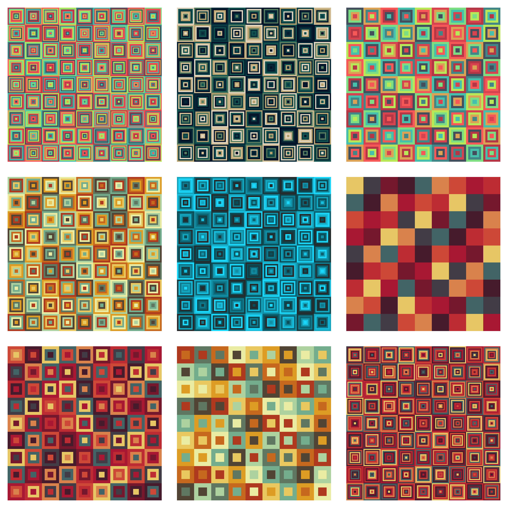

```{r setup, include=FALSE}
knitr::opts_chunk$set(echo = FALSE)
```


# 내가 기대하는 텍스트 분석

사실 텍스트 분석이 무엇인지 **아직 잘 모릅니다.** 
다만 우리의 환경이 텍스트로 둘러싸여 있다는 것은 압니다. 
이들 간의 관계를 파악해서 쓸모를 찾고 싶습니다. 
<br>
**기록은 대부분이 텍스트로 구성**되어 있습니다. 
기록관리를 공부하는 학생으로서 
**텍스트 분석은 유용한 연구도구**가 될 것으로 기대합니다.
<br>

```{r network, echo=FALSE, out.width = "55%", fig.align='center'}

```


# 감사합니다.

여기까지입니다. **끝**

<br>

```{r gis, echo=FALSE, out.width = "70%", fig.align='center'}

```

